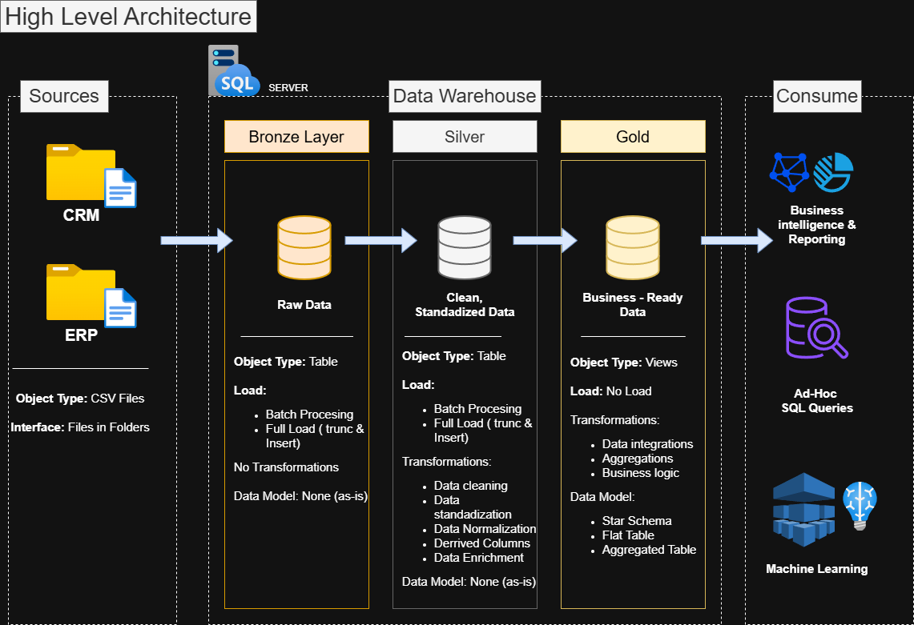

# Data Warehouse and Analytics Project

Welcome to the **Data Warehouse and Analytics Project** repository!🚀
This project demonstrates a comprehensive data warehousing  and analytics solution, from building a data warehouse to generating actionable insights. Designed as a portfolio project, it highlights best practices in data engineering and analytics.

---
## 📚Project Overview
This Project involves:
1. **Data Architecture:** Designing a modern Data Warehouse Using Medallion Architecture **Bronze**, **Silver** and **Gold** layers.
2. **ETL Pipelines:** Extracting, Transforming and Loading data from source systems in to the warehouse.
3. **Data Modelling** Developing fact and dimension tables optimised for analytical queries.
4. **Analytics & Reporting:** CReating SQL-based reports and dashboards for actionable insights.

✅This repository is an excellent resource fo revising and polishing best practice as well as showcasing expertise and proficiency in the following:
- SQL Development
- Data Architect
- Data Engineering
- ETL Pipeline Developer
- Data Modelling
- Data Analytics
---
## 🔗Attributions 🙏
A big Thank you to 'Data with Baara'. I'm Very grateful to have encountered this course on YouTube !!Absolutely FREE!!.
For anyone else out there who is serious about changing their career to enter the world of coding but does not know where to begin, please give yourself sometime and have a look at this: [SQL Full Course for Beginners (30 Hours) – From Zero to Hero](https://www.youtube.com/watch?v=SSKVgrwhzus)

---

## 📋Project requirements

### Building the data Warehouse (Data Engineering)

#### Objective🎯
Develop a modern data warehouse using SQL Server to consolidate sales data, enabling analytical reporting and informed decision-making.

#### Specifications
- ***Data Sources***: import data from two source systems (ERP and CRM) provided as CSV files.
- ***Data Quality***: Cleanse and resolve data quality issues prior to analytics.
- ***Integration***: Combine both sources into a single user-friendly data model designed for analytical queries.
- ***Scope***: Focus on the latest dataset only; historization of data is not required.
- ***Documentation***: Provide clear documentation of the data model to support both business stakeholders and analytics teams.

---

### BI: Analytical & Reporting (Data Analytics)

### Objective
Develop SQL-based analytics to deliver detailed insights into:
- ***Customer Behaviour***
- ***Product Performance***
- ***Sales Trends***

These insights empower stakeholders with key business metrics, enabling strategic decision-making

---
## 🏗️Data Architecture

---

## License

This Project is licensed under the [MIT License](License). You are free to use, modify and share this project with proper attribution.

## About Me

Hi, I'm **Kenneth Ssempala Nsubuga**. My background is Furniture and product design. Experienced Furniture maker and Joinery CAD Technician. Beginning of **2022**, I started working with software like **Fusion 360**, **AutoCAD**, **[F4®Integrate - Felder Group](https://www.felder-group.com/en-gb/products/f4solutions-software-c596305/software-f4integrate-p596313)**, **[Cabinet Vision & AlphaCAM](https://hexagon.com/products/product-groups/computer-aided-manufacturing-cad-cam-software)**, **Adobe Illustrator**. My General job requirements were, to prepare technical design and machining data (including CAM programming and CNC ready machining programs), drawings for CNC machining manufacture and manual Assembly.

Over the years I've found that the various softwares used through the design tp manufacture process are either cumbersome or expensive. 

As well as this being a journey to grow my proficiency in the 'coding' it is also the 'vehicular-academy' guiding me closer to devising solutions to problems ive encountered daily as a professional.

[Cabinet Vision & AlphaCAM]:(https://hexagon.com/products/product-groups/computer-aided-manufacturing-cad-cam-software)

[F4®Integrate - Felder Group]:(https://www.felder-group.com/en-gb/products/f4solutions-software-c596305/software-f4integrate-p596313)

[SQL Full Course for Beginners (30 Hours) – From Zero to Hero]:(https://www.youtube.com/watch?v=SSKVgrwhzus)
